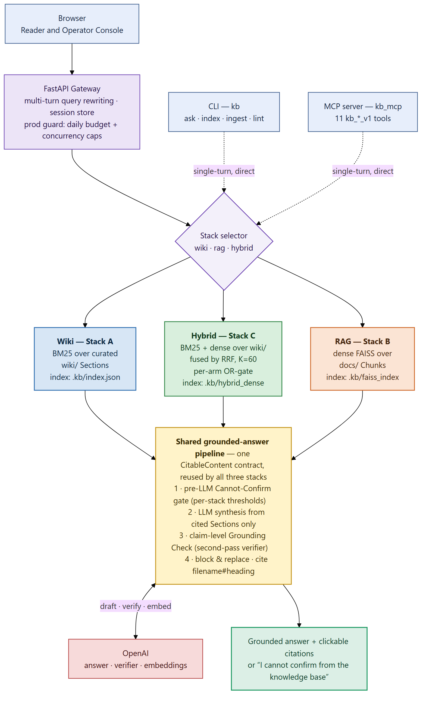
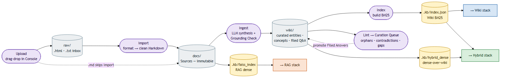
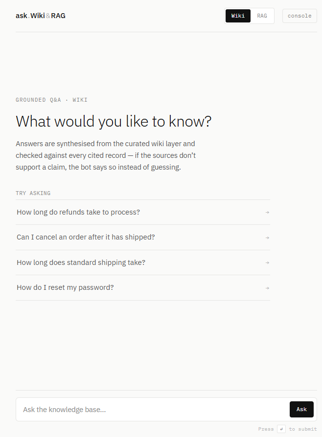
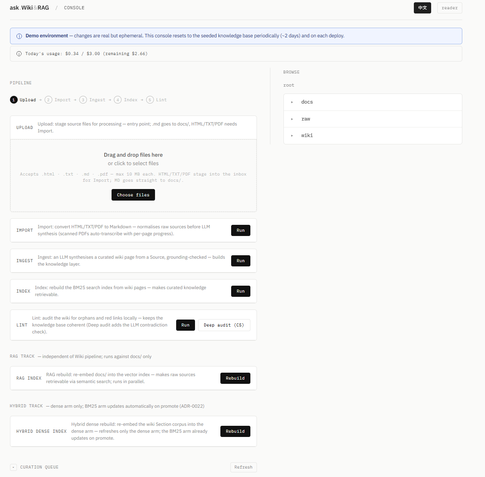

# Knowledge Base Q&A Bot

**English** · [繁體中文](#繁體中文)

[](https://ask-wiki-rag.paynepew.dev)


A grounded Q&A bot over a Markdown knowledge base. Every answer is assembled only
from cited records. When the sources don't back a claim, the bot says
_"I cannot confirm from the knowledge base"_ rather than guessing.

The same question can run against **three retrieval stacks**, switchable from one
toggle:

| Stack | How it retrieves | Corpus |
| --- | --- | --- |
| **Wiki** (A) | BM25 keyword search over a curated `wiki/` layer ([Karpathy's LLM Wiki](https://gist.github.com/karpathy/442a6bf555914893e9891c11519de94f) pattern) | `wiki/` Sections |
| **RAG** (B) | Dense vector search (FAISS) over raw chunks | `docs/` Chunks |
| **Hybrid** (C) | BM25 **and** dense over the same `wiki/` layer, fused by Reciprocal Rank Fusion | `wiki/` Sections |

**Live demo: <https://ask-wiki-rag.paynepew.dev>.** Reader at `/`, Operator
Console at `/console`.

## Architecture

One question enters from any of three interfaces, a stack is selected, and all
three stacks hand off to **one shared grounded-answer pipeline**. Adding the
Hybrid stack was a single dispatch entry plus a dense index and an RRF merge.
The grounding check, citation, page expansion, and "I cannot confirm" gate were
already written once and reused.



The Browser talks to a FastAPI **Gateway** that owns multi-turn query rewriting,
the session store, and a production guard (daily budget + concurrency caps). The
**CLI** (`kb`) and the **MCP server** (`kb_mcp`) skip the Gateway and call the
same stacks directly, single-turn. The three interfaces share no state except
the files on disk. They meet at the corpus.

### How knowledge gets in

Sources in `docs/` are immutable. **Ingest** synthesises them once into a curated
`wiki/` layer (with a Grounding Check on every page it writes), and three indexes
are built from that corpus. This is the write side of the Operator Console.



> Diagram sources live next to the images as editable Mermaid:
> [`runtime.mmd`](project-docs/architecture/runtime.mmd),
> [`lifecycle.mmd`](project-docs/architecture/lifecycle.mmd).

## Technical highlights

- **Grounded by construction, not by prompt.** A pre-LLM relevance gate decides
  whether the retrieved context is strong enough to answer at all; after the LLM
  drafts, a second model pass (the **Grounding Check**) extracts each atomic
  claim and checks it against the cited Sections. One unsupported claim discards
  the whole draft and returns _"I cannot confirm."_ The system fails closed.
- **Three retrieval architectures behind one toggle**, compared with an honest,
  statistically-tested benchmark (Cochran's Q omnibus → post-hoc McNemar with
  Holm correction), not a hand-picked headline number.
- **Same-corpus Hybrid fusion.** Both Hybrid arms index the _same_ wiki Sections,
  so their ids align 1:1 and Reciprocal Rank Fusion (K=60) needs no score
  reconciliation between BM25 magnitude and FAISS distance. The Cannot-Confirm
  gate is a per-arm **OR** over each arm's own calibrated threshold: recall-union
  without inventing a new threshold.
- **Deep-module reuse.** Every stack returns a `Section` or `Chunk` that satisfies
  one `CitableContent` protocol, so grounding, citation, page expansion, and the
  refusal gate are written once and shared across all three.
- **Bilingual end to end.** Files and questions work in English or
  Traditional/Simplified Chinese; the keyword stacks tokenise CJK by character
  n-gram and apply a per-language score threshold, and Chinese questions get
  Chinese answers.
- **Three interfaces over one corpus.** Browser, CLI, and MCP server each drive
  the full Upload → Import → Ingest → Index → Lint lifecycle; they share state
  only through the filesystem.
- **Production posture.** Dockerised, with image-pull CD to a VPS on every push to
  `main` (GHCR → SSH → `/healthz` smoke). A `/healthz/shed` probe sheds reader
  traffic at the edge under load; a daily USD budget guard and read/admin
  concurrency caps protect the box. The retrieval indexes ship committed, so a
  fresh clone answers on the first run.

## Quick start

The retrieval indexes ship **pre-built and committed**, so a fresh clone answers
questions immediately, with no build step on the first run.

```bash
# 1. Clone
git clone https://github.com/PaynePew/knowledge_base_qa_bot.git
cd knowledge_base_qa_bot

# 2. Install (single .venv at the repo root)
uv sync --all-packages

# 3. Add your OpenAI key
cp .env.example .env        # then edit .env and set OPENAI_API_KEY=sk-...

# 4. Launch the Gateway (serves the UI and all three stacks on one origin)
uv run uvicorn gateway.app.main:app --port 8000
```

Open <http://localhost:8000/> for the Reader and <http://localhost:8000/console>
for the Console.

> **Keys.** `OPENAI_API_KEY` is **required**: every stack calls OpenAI to write
> the final answer and to embed (RAG and Hybrid). `ANTHROPIC_API_KEY` is
> **optional**, used only by the evaluation's cross-family Claude judge. See
> [`.env.example`](.env.example).

## Using the Reader

**Reader.** Ask a question, pick a stack, and read a grounded answer.



- **Ask anything** in the box (English _or_ Chinese) and press Enter.
- **Toggle Wiki / RAG / Hybrid** to run the same question against each retrieval
  stack and compare them side by side.
- **Sources appear first** (the records the answer is grounded in), then the
  answer streams in below them.
- A **grounding badge** confirms every claim traces back to a cited source; if it
  can't, you get _"I cannot confirm"_ instead of a hallucination.
- **Follow-up questions** continue the same conversation (multi-turn on the web
  path). Switching stacks keeps the conversation history.

## Using the Console

**Operator Console.** The admin interface: upload documents, run the build
pipeline, and keep a company or personal knowledge base healthy.



Before the Wiki stack can retrieve a file, it passes through the pipeline stepper,
each step with its own **Run** button.

**A file's journey, Upload → Import → Ingest → Index:**

| Step | What it does |
| --- | --- |
| **Upload** | Drag-drop files. `.html` / `.txt` land in `raw/`; `.md` goes straight to `docs/`. |
| **Import** | Convert `raw/` sources into clean Markdown in `docs/` (with provenance). |
| **Ingest** | An LLM synthesises `docs/` Sources into curated `wiki/` pages, grounding-checked as they are written. |
| **Index** | Build the BM25 index (and the dense-over-wiki index) so new content is answerable. |

The **RAG track** (separate panel) rebuilds the FAISS vector index from `docs/`,
independent of the Wiki chain. Click **Rebuild**.

**Lint and the Curation Queue.** Run **Lint** after editing the corpus, or
periodically, to audit knowledge-base health: orphan pages, broken
`[[wikilinks]]`, contradictions between pages, stale pages, and coverage gaps.
Lint findings feed the **Curation Queue**, where you review the bot's auto-filed
Q&A drafts and either **Promote** a good one to a permanent page or **Discard**
it. This is how good answers fold back into the knowledge base over time.

The **Resource Browser** at the bottom reads through `docs/`, `raw/`, and `wiki/`
without leaving the page.

## Project structure

```
knowledge_base_qa_bot/
├── gateway/          # FastAPI Gateway + browser UI (Reader at /, Console at /console); start here
├── markdown_kb/      # Wiki stack (A): BM25 over the curated wiki/ layer + the shared grounding pipeline
├── vector_rag/       # RAG stack (B): chunk + embed docs/ into FAISS
├── hybrid_kb/        # Hybrid stack (C): BM25 + dense over wiki/, fused by RRF
├── kb_cli/           # The `kb` command-line interface
├── kb_mcp/           # The kb_mcp MCP server (Claude Desktop compatible)
├── docs/             # Sources: the bot's immutable runtime knowledge base
├── wiki/             # Curated layer written by Ingest (concepts, entities, filed Q&A)
├── raw/              # Local inbox for uploaded .html/.txt before Import
├── .kb/              # Committed indexes: index.json (BM25), faiss_index/ (RAG), hybrid_dense/ (Hybrid)
├── eval/             # Three-stack paraphrase comparison harness + report
├── project-docs/     # ADRs, roadmap, coding standard, architecture diagrams, screenshots
├── CONTEXT.md        # Shared vocabulary (glossary)
└── .env.example      # Copy to .env and add your OpenAI key
```

## Evaluation: three stacks, measured

Does a curated Wiki + BM25 actually out-retrieve plain Vector RAG on the same raw
corpus, and where does Hybrid land? The benchmark answers it with real numbers
rather than assertion.

**Test set.** 260 queries over one 20-Source / ~51-Gold-Section corpus:
**250 Core paraphrases** (5 LLM-generated rewrite types × 50) plus **10
hand-written structural probes** (2 types × 5). A "hit" requires the retrieved
unit to match the gold section _and_ share content key-tokens, so a
right-document-wrong-content result is a miss.

**Method.** Each arm overfetches a deep candidate pool once per query, decoupled
from the cutoff; hit-rate is reported across a sweep (hit@{1,3,5,10}) plus MRR. A
three-way **Cochran's Q** omnibus gates **post-hoc pairwise McNemar** (with Holm
correction), so no pairwise claim is made unless the omnibus first says some arm
differs. The dense arms use real OpenAI `text-embedding-3-small`.

**Core results (macro-average hit@3, real embeddings):**

| | Wiki (A) | RAG (B) | Hybrid (C) |
| --- | --- | --- | --- |
| hit@3 | 0.880 | **0.936** | 0.924 |
| MRR | 0.807 | **0.863** | 0.849 |

The omnibus is significant (Cochran's Q = 7.95, p = 0.019). After Holm
correction, the **only** pairwise gap that survives is **Hybrid > Wiki**
(p = 0.010); Wiki↔RAG (p = 0.077) and Hybrid↔RAG (p = 0.71) are statistically
indistinguishable. On natural paraphrases the three stacks land close together.
The structural probes are where they separate.

**What the per-type data shows:**

- **Synonyms and unseen jargon are Wiki's weak spot.** When a query uses
  vocabulary absent from the source, keyword BM25 can miss where vector
  similarity matches: synonym_swap Wiki 0.84 vs RAG 0.94, with the
  industry-jargon probe the extreme (Wiki 0.40 vs RAG 1.00, Hybrid 0.60). Hybrid
  recovers part of RAG's edge while keeping wiki-Section citations.
- **Cost is asymmetric, and the headline numbers hide it.** Wiki pays a one-shot
  LLM synthesis cost at ingest and then retrieves for free; RAG and Hybrid pay a
  per-query embedding cost forever. The retrieval scores don't capture this; the
  report's cost log does.
- **Citation quality is Wiki's structural edge.** Wiki and Hybrid cite a stable
  `filename#heading` with `sources:` provenance that is grounding-checked at
  ingest; RAG cites raw chunks by similarity, usually losing section boundaries.


The honest reading: at this corpus scale (curated FAQ / policy, well under ~1000
pages), the differences on natural questions are small and mostly don't survive
correction. Wiki trades a few points of recall for zero per-query cost, an
inspectable index, and structured provenance; Hybrid buys back most of that
recall while keeping the wiki-Section citation. The full methodology, statistical
tests, cost log, and disclosed limitations are in
[`eval/paraphrase_comparison/report.md`](eval/paraphrase_comparison/report.md);
the design rationale is in [`why-wiki.md`](project-docs/why-wiki.md). To
regenerate the corpus and re-run the comparison, see the maintainer runbook at
[`eval/paraphrase_comparison/README.md`](eval/paraphrase_comparison/README.md).

## CLI and MCP reference

The CLI (`kb`) and the MCP server (`kb_mcp`) drive the same lifecycle as the
Console, over the same on-disk corpus.

### CLI subcommands (`uv run kb <subcommand>`)

| Command | Description |
| --- | --- |
| `kb ask <question> [--stack wiki\|rag\|hybrid]` | Ask a question and print a grounded answer (LLM synthesis + Grounding Check). |
| `kb index` | Rebuild the BM25 Section Index from the wiki corpus and persist it to `.kb/index.json`. |
| `kb import <path>` | Import a local file (`.html`, `.txt`, `.md`) into `docs/` via format conversion. |
| `kb ingest [source]` | Synthesise one named `docs/` Source (or all Sources when omitted) into `wiki/` pages. |
| `kb lint` | Run the Lint Pass health check (orphans, contradictions, stale pages, coverage gaps). |
| `kb` (bare) | Enter the interactive REPL with a warm index; supports `:stack <wiki\|rag\|hybrid>` and `quit`. |

### MCP tools (`kb_mcp` server)

| Tool | Description |
| --- | --- |
| `kb_ask_v1` | Ask a question and receive a grounded answer with citations and a Grounding Check result. Accepts `stack = wiki \| rag \| hybrid`. |
| `kb_search_v1` | Retrieve raw Sections or Chunks with no LLM synthesis; returns BM25 scores for the keyword stacks. Accepts `stack = wiki \| rag \| hybrid`. |
| `kb_read_hot_v1` | Read the working-memory hot cache (`wiki/hot.md`); returns `""` on the first session. |
| `kb_save_hot_v1` | Persist a working-memory summary (composed by the host) to the hot cache. |
| `kb_capture_v1` | Write a Markdown Source directly from conversation to `docs/`; stamps provenance frontmatter. |
| `kb_import_v1` | Import a local file by absolute path into `docs/` via the same conversion pipeline as `kb import`. |
| `kb_ingest_v1` | Ingest a single named `docs/` Source into `wiki/` pages, auto-routing large Sources to a background job. |
| `kb_ingest_start_v1` | Submit a Source to the background ingest job and return immediately. |
| `kb_ingest_status_v1` | Poll the status of a background ingest job. |
| `kb_index_v1` | Rebuild the BM25 Section Index and return `{files_indexed, sections_indexed}`. |
| `kb_lint_v1` | Run the Lint Pass and return structured findings; can skip the LLM-backed contradiction check. |

> **Read surface stays stable.** `kb ask`, `kb_ask_v1`, `kb_search_v1`, and the
> Hot Cache pair keep their contracts; the Hybrid stack was added as a new `stack`
> value, not a new read API.

### Concurrency recovery

Concurrent writes from two interfaces (e.g. `kb_ingest_v1` from MCP while
`kb ingest` runs in a terminal) can leave `.kb/index.json` stale. The index is
fully regenerable: re-run `kb index` (CLI) or call `kb_index_v1` (MCP) to rebuild
it from the wiki corpus.

---

## Deep dive

- [`CONTEXT.md`](CONTEXT.md): the project's shared vocabulary.
- [`PROMPT.md`](PROMPT.md): the exercise spec and design answers.
- [`project-docs/adr/`](project-docs/adr/): architectural decisions (ADR-0018 covers Hybrid).
- [`project-docs/roadmap.md`](project-docs/roadmap.md): the full implementation sequence.

---

# 繁體中文

[English](#knowledge-base-qa-bot) · **繁體中文**

[](https://ask-wiki-rag.paynepew.dev)


一個建立在 Markdown 知識庫之上、「有根據」的問答機器人。每個答案都只由引用到的
記錄組成;當來源無法支持某個說法,機器人會回答 _"I cannot confirm from the
knowledge base"_,而不是亂猜。

同一個問題可以丟給**三套檢索引擎**,用一個切換鈕即時對照:

| 引擎 | 怎麼檢索 | 語料 |
| --- | --- | --- |
| **Wiki**(A) | 在精選的 `wiki/` 層上做 BM25 關鍵詞檢索([Karpathy LLM Wiki](https://gist.github.com/karpathy/442a6bf555914893e9891c11519de94f) 模式) | `wiki/` Sections |
| **RAG**(B) | 在原始 chunk 上做密集向量檢索(FAISS) | `docs/` Chunks |
| **Hybrid**(C) | 在**同一個** `wiki/` 層上同時跑 BM25 與密集向量,再以 Reciprocal Rank Fusion 融合 | `wiki/` Sections |

**線上 Demo:<https://ask-wiki-rag.paynepew.dev>。** Reader 在 `/`,
Operator Console 在 `/console`。

## 系統架構

一個問題從三種介面之一進來、選定一套引擎,三套引擎最後都交給**同一條「有根據答案」
管線**。加入 Hybrid 引擎只動了一個 dispatch 進入點,外加一個密集索引與 RRF 融合
—— grounding 檢查、引用、頁面展開、以及「I cannot confirm」閘門,早就寫好一次、
三套共用。


瀏覽器連到一個 FastAPI **Gateway**,由它負責多輪查詢改寫、session store、以及
正式環境保護(每日預算 + 並發上限)。**CLI**(`kb`)與 **MCP 伺服器**
(`kb_mcp`)則略過 Gateway,直接呼叫同樣那三套引擎(單輪)。三種介面之間唯一共用
的狀態,就是磁碟上的檔案 —— 它們在語料層相會。

### 知識怎麼進來

`docs/` 裡的 Sources 是不可變的。**Ingest** 會把它們合成一次成為精選的 `wiki/`
層(每寫一頁都跑 Grounding Check),再從這份語料建出三個索引。這就是 Operator
Console 的寫入側。


> 圖檔旁邊就是可編輯的 Mermaid 原始碼:
> [`runtime.mmd`](project-docs/architecture/runtime.mmd)、
> [`lifecycle.mmd`](project-docs/architecture/lifecycle.mmd)。

## 技術亮點

- **有根據是靠架構,不是靠 prompt。** LLM 之前先有一道相關性閘門,判斷檢索到的
  context 夠不夠強到能回答;LLM 起草之後,再由第二次模型呼叫(**Grounding
  Check**)逐一抽出原子級主張,對照引用的 Sections 檢核。只要有一個主張不被支持,
  整份草稿就作廢、回 _"I cannot confirm"_。系統 fail closed。
- **三套檢索架構共用一個切換鈕**,並用一個誠實、有統計檢定的基準對照
  (Cochran's Q omnibus → 事後 McNemar + Holm 校正),而不是挑一個好看的頭條數字。
- **同語料的 Hybrid 融合。** Hybrid 的兩條臂索引的是**同一份** wiki Sections,
  id 1:1 對齊,所以 Reciprocal Rank Fusion(K=60)不需要去調和 BM25 分數與 FAISS
  距離兩種尺度。Cannot-Confirm 閘門是對每條臂各自校正後門檻取 **OR** —— 達成
  recall-union,而不必新增任何門檻。
- **Deep module 重用。** 每套引擎回傳的 `Section` 或 `Chunk` 都符合同一個
  `CitableContent` 協定,所以 grounding、引用、頁面展開、拒答閘門都只寫一次、三套
  共用。
- **中英雙語貫通。** 檔案與問題都可用英文或繁/簡中文;關鍵詞引擎以字元 n-gram 對
  CJK 斷詞,並套用分語言的分數門檻,中文問題給中文答案。
- **三種介面、同一份語料。** 瀏覽器、CLI、MCP 伺服器都能驅動完整的 Upload →
  Import → Ingest → Index → Lint 生命週期;它們只透過檔案系統共享狀態。
- **正式環境就緒。** 已容器化,每次 push 到 `main` 就以 image-pull 方式 CD 到 VPS
  (GHCR → SSH → `/healthz` smoke)。`/healthz/shed` 探針會在負載過高時於邊緣端
  卸載 reader 流量;每日 USD 預算閘門與讀/管理並發上限保護機器。檢索索引隨 repo
  提交,所以剛 clone 下來第一次就能問答。

## 快速開始

檢索索引已**預先建好並提交**,所以剛 clone 下來就能立刻問答 —— 第一次執行不需要
任何建置步驟。

```bash
# 1. Clone
git clone https://github.com/PaynePew/knowledge_base_qa_bot.git
cd knowledge_base_qa_bot

# 2. 安裝(repo 根目錄共用一個 .venv)
uv sync --all-packages

# 3. 設定你的 OpenAI key
cp .env.example .env        # 接著編輯 .env,填入 OPENAI_API_KEY=sk-...

# 4. 啟動 Gateway(同一個來源同時提供 UI 與三套引擎)
uv run uvicorn gateway.app.main:app --port 8000
```

開啟 <http://localhost:8000/> 進入 Reader,或 <http://localhost:8000/console>
進入 Console。

> **關於 key。** `OPENAI_API_KEY` 是**必填** —— 三套引擎都會呼叫 OpenAI 來產生
> 最終答案,RAG 與 Hybrid 還會用它做 embedding。`ANTHROPIC_API_KEY` 是**選填**,
> 只有評測用的跨家族 Claude judge 會用到。詳見 [`.env.example`](.env.example)。

## 操作 Reader

**Reader(閱讀端)** —— 輸入問題、選擇引擎、讀取有根據的答案。


- 在輸入框**輸入任何問題**(英文**或**中文),按 Enter。
- **切換 Wiki / RAG / Hybrid**,用同一個問題去問三套引擎,並排比較。
- **資料來源先行** —— 也就是答案所依據的記錄 —— 接著答案會在下方逐字串流出現。
- **grounding 標章**會確認每個說法都能追溯到引用來源;若無法,你會看到
  _"I cannot confirm"_,而不是幻覺式答案。
- **後續追問**會延續同一段對話(網頁路徑支援多輪);切換引擎時對話歷史保留。

## 操作 Console

**Operator Console(操作主控台)** —— 後台介面:上傳文件、執行建置流程、維護公司
或個人知識庫的健康度。


Wiki 引擎要能檢索一份檔案,得先走過流程步驟器,每個步驟各有自己的 **Run** 按鈕。

**一份檔案的旅程 —— Upload → Import → Ingest → Index:**

| 步驟 | 做什麼 |
| --- | --- |
| **Upload** | 拖放檔案。`.html` / `.txt` 進入 `raw/`;`.md` 直接進入 `docs/`。 |
| **Import** | 把 `raw/` 的來源轉成乾淨的 Markdown 放進 `docs/`(含出處)。 |
| **Ingest** | 由 LLM 把 `docs/` 的 Sources 合成為精選的 `wiki/` 頁面,寫入時即做 grounding 檢查。 |
| **Index** | 建立 BM25 索引(以及 dense-over-wiki 索引),讓新內容可被問答。 |

**RAG track**(獨立面板)會從 `docs/` 重建 FAISS 向量索引,與 Wiki 流程互不相干
—— 點 **Rebuild** 即可。

**Lint 與策展佇列。** 在編輯語料之後、或定期執行 **Lint** 來稽核知識庫健康度:
孤立頁面、壞掉的 `[[wikilink]]`、頁面之間的矛盾、過時頁面、以及涵蓋缺口。Lint
結果會餵進 **Curation Queue(策展佇列)**,你可在此檢視機器人自動歸檔的 Q&A 草稿,
把好的**升級(Promote)**成永久頁面,或**捨棄(Discard)** —— 這就是高品質答案
逐步被收回知識庫的方式。

頁面底部的 **Resource Browser** 讓你不離開頁面就能瀏覽 `docs/`、`raw/`、`wiki/`。

## 專案結構

```
knowledge_base_qa_bot/
├── gateway/          # FastAPI Gateway + 瀏覽器 UI(Reader 在 /,Console 在 /console)——從這裡開始
├── markdown_kb/      # Wiki 引擎(A):wiki/ 層上的 BM25 + 共用的有根據答案管線
├── vector_rag/       # RAG 引擎(B):把 docs/ 切塊並嵌入 FAISS
├── hybrid_kb/        # Hybrid 引擎(C):wiki/ 上的 BM25 + 密集向量,RRF 融合
├── kb_cli/           # `kb` 命令列介面
├── kb_mcp/           # kb_mcp MCP 伺服器(相容 Claude Desktop)
├── docs/             # Sources——機器人執行時、不可變的知識庫
├── wiki/             # Ingest 寫出的精選層(concepts、entities、歸檔 Q&A)
├── raw/              # 上傳的 .html/.txt 在 Import 前的本機收件匣
├── .kb/              # 提交進 repo 的索引:index.json(BM25)、faiss_index/(RAG)、hybrid_dense/(Hybrid)
├── eval/             # 三引擎改寫比較工具 + 報告
├── project-docs/     # ADR、roadmap、coding standard、架構圖、screenshots
├── CONTEXT.md        # 共用詞彙表(glossary)
└── .env.example      # 複製成 .env 並填入你的 OpenAI key
```

## 評測:三套引擎,用數字說話

精選 Wiki + BM25 真的能在同一份原始語料上贏過一般的 Vector RAG 嗎 —— 而 Hybrid
又落在哪裡?這個基準用真實數字回答,而不是嘴上說說。

**測試資料量。** 在一份 20-Source / 約 51 個 Gold Section 的語料上,共 260 筆
查詢:**250 筆 Core 改寫**(5 種 LLM 生成的改寫類型 × 50)加上 **10 筆手寫的結構
性探針**(2 種 × 5)。「命中」必須是檢索結果的來源符合 gold section **且**內容共享
關鍵詞,所以「文件對、內容不對」算未命中。

**方法。** 每套引擎每筆查詢只 overfetch 一次深層候選池,與最終 cutoff 解耦;命中率
跨 cutoff 報告(hit@{1,3,5,10})並附 MRR。三方 **Cochran's Q** omnibus 把關事後的
配對 **McNemar**(加 Holm 校正)—— omnibus 先說「有某套引擎不一樣」,才會做任何
配對宣稱。密集臂使用真實的 OpenAI `text-embedding-3-small`。

**Core 結果(macro 平均 hit@3,真實 embedding):**

| | Wiki(A) | RAG(B) | Hybrid(C) |
| --- | --- | --- | --- |
| hit@3 | 0.880 | **0.936** | 0.924 |
| MRR | 0.807 | **0.863** | 0.849 |

omnibus 顯著(Cochran's Q = 7.95,p = 0.019)。經 Holm 校正後,**唯一**存活的配對
差異是 **Hybrid > Wiki**(p = 0.010);Wiki↔RAG(p = 0.077)與 Hybrid↔RAG
(p = 0.71)在統計上無法區分。在自然改寫上三套引擎相當接近 —— 真正拉開差距的是
結構性探針。

**逐型別數據顯示:**

- **同義詞與沒見過的行話是 Wiki 的弱點。** 當查詢用了來源中沒出現的詞彙,關鍵詞
  BM25 可能漏掉、而向量相似度能命中:synonym_swap Wiki 0.84 vs RAG 0.94,而「行話」
  探針是極端例子(Wiki 0.40 vs RAG 1.00,Hybrid 0.60)。Hybrid 在保留 wiki-Section
  引用的同時,補回了 RAG 的部分優勢。
- **成本是不對稱的,而頭條數字藏住了它。** Wiki 在 ingest 付一次性的 LLM 合成成本,
  之後檢索免費;RAG 與 Hybrid 則每次查詢都要付 embedding 成本。檢索分數看不出這點
  —— 報告的 cost log 看得出。
- **引用品質是 Wiki 的結構性優勢。** Wiki 與 Hybrid 引用穩定的 `filename#heading`,
  並帶有在 ingest 時做過 grounding 檢查的 `sources:` 出處;RAG 以相似度引用原始
  chunk,通常會遺失章節邊界。


誠實的解讀:在這個語料規模(精選 FAQ / 政策,遠低於約 1000 頁),自然問題上的差異
很小,且多半撐不過校正。Wiki 用幾個百分點的 recall,換到每次查詢零成本、可檢視的
索引、以及結構化出處;Hybrid 則買回大部分 recall,又保住 wiki-Section 引用。完整
的方法、統計檢定、成本紀錄與誠實的限制說明,都在
[`eval/paraphrase_comparison/report.md`](eval/paraphrase_comparison/report.md);
設計取捨見 [`why-wiki.md`](project-docs/why-wiki.md)。若要重新產生語料並重跑比較,
請見維護者操作手冊 [`eval/paraphrase_comparison/README.md`](eval/paraphrase_comparison/README.md)。

## CLI 與 MCP 指令參考

CLI(`kb`)與 MCP 伺服器(`kb_mcp`)驅動的是與 Console 相同的生命週期、操作的是同
一份磁碟語料。

### CLI 子命令(`uv run kb <subcommand>`）

| 命令 | 說明 |
| --- | --- |
| `kb ask <question> [--stack wiki\|rag\|hybrid]` | 詢問問題並輸出有根據的答案(LLM 合成 + Grounding Check)。 |
| `kb index` | 從 wiki 語料重建 BM25 Section Index 並寫入 `.kb/index.json`。 |
| `kb import <path>` | 將本機檔案（`.html`、`.txt`、`.md`)透過格式轉換匯入 `docs/`。 |
| `kb ingest [source]` | 把指定的 `docs/` Source（或省略時所有 Source)合成為 `wiki/` 頁面。 |
| `kb lint` | 執行 Lint Pass 健康度檢查（孤立頁面、矛盾、過時頁面、涵蓋缺口)。 |
| `kb`（直接執行）| 進入有暖索引的互動式 REPL;支援 `:stack <wiki\|rag\|hybrid>` 與 `quit`。 |

### MCP 工具（`kb_mcp` 伺服器)

| 工具 | 說明 |
| --- | --- |
| `kb_ask_v1` | 詢問問題並取得帶引用與 Grounding Check 結果的有根據答案。可選 `stack = wiki \| rag \| hybrid`。 |
| `kb_search_v1` | 從索引取回原始 Section 或 Chunk,不呼叫 LLM;關鍵詞引擎回傳 BM25 分數。可選 `stack = wiki \| rag \| hybrid`。 |
| `kb_read_hot_v1` | 讀取工作記憶熱快取（`wiki/hot.md`);第一次呼叫時回傳 `""`。 |
| `kb_save_hot_v1` | 將由 host 組成的工作記憶摘要寫入熱快取。 |
| `kb_capture_v1` | 直接從對話將 Markdown Source 寫入 `docs/`;自動加上出處 frontmatter。 |
| `kb_import_v1` | 透過與 `kb import` 相同的轉換流程,用絕對路徑將本機檔案匯入 `docs/`。 |
| `kb_ingest_v1` | 將單一指定 `docs/` Source 合成為 `wiki/` 頁面,過大的 Source 會自動轉到背景工作。 |
| `kb_ingest_start_v1` | 把 Source 丟進背景 ingest 工作並立即返回。 |
| `kb_ingest_status_v1` | 查詢背景 ingest 工作的狀態。 |
| `kb_index_v1` | 重建 BM25 Section Index,回傳 `{files_indexed, sections_indexed}`。 |
| `kb_lint_v1` | 執行 Lint Pass 並回傳結構化結果;可跳過 LLM-backed 的矛盾檢查。 |

> **讀取介面維持穩定。** `kb ask`、`kb_ask_v1`、`kb_search_v1` 與熱快取組合都保留
> 既有合約;Hybrid 是以新的 `stack` 值加入,而非新增讀取 API。

### 並發復原

兩個界面同時寫入(例如 MCP 的 `kb_ingest_v1` 與終端機的 `kb ingest` 同時執行),
最壞情況會讓 `.kb/index.json` 停在過期狀態。索引可完整重新產生:重新執行
`kb index`（CLI)或呼叫 `kb_index_v1`（MCP)即可從 wiki 語料重建。

---

## 深入閱讀

- [`CONTEXT.md`](CONTEXT.md) —— 專案的共用詞彙表。
- [`PROMPT.md`](PROMPT.md) —— 題目規格與設計解答。
- [`project-docs/adr/`](project-docs/adr/) —— 架構決策（ADR-0018 涵蓋 Hybrid)。
- [`project-docs/roadmap.md`](project-docs/roadmap.md) —— 完整的實作順序。
