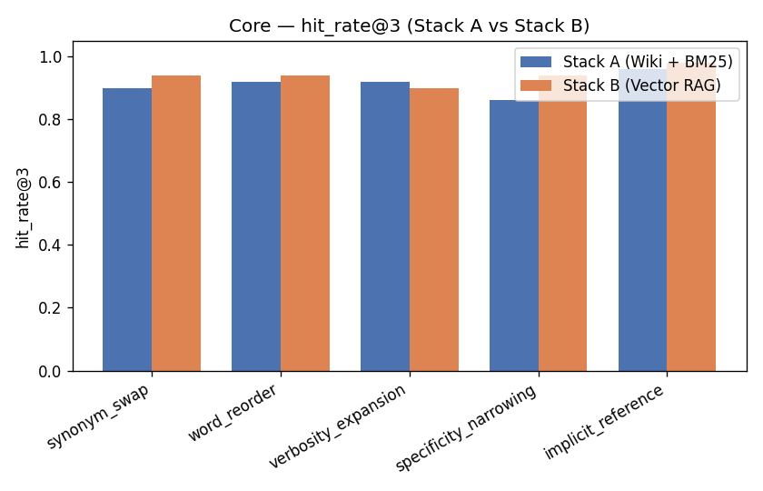
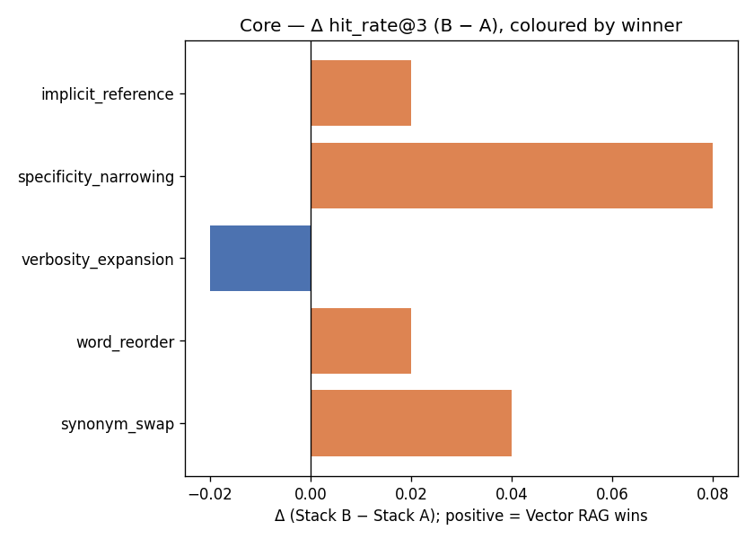
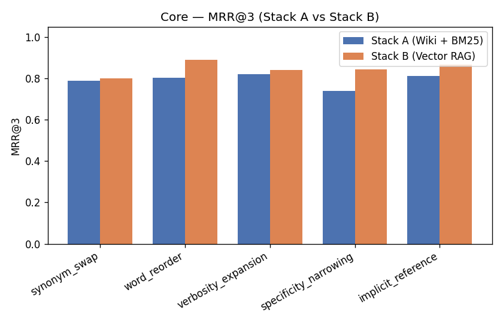
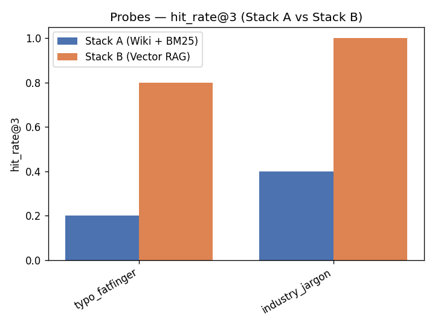
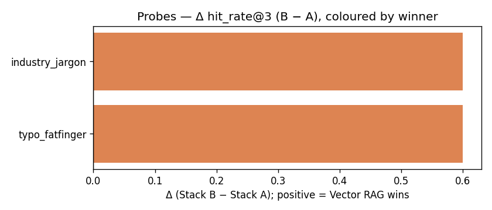
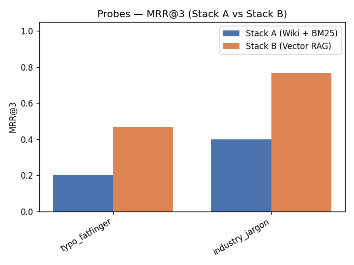

# Paraphrase Comparison Report

Phase 8 retrieval comparison (PRD #100): does Karpathy's curated-Wiki layer (**Stack A** — LLM-synthesised `wiki/` + BM25) out-retrieve a traditional Vector RAG pipeline (**Stack B** — chunk + embed + FAISS) fed the **same** raw corpus? Scored at the retrieval layer only by the deterministic C5c hit metric (source-match AND dual-side Key-Token overlap). K=3.

## TL;DR

On this 20-Source Acme Shop corpus, the Core macro-average hit_rate@3 is **Stack A 0.912** vs **Stack B 0.940** (L1 (deterministic) numbers). The per-type breakdown is the real signal — the macro-average is a researcher-chosen type mix and is reported only with the caveat below. Structural probes are reported separately and framed as expected-limit confirmation, never folded into a headline number.

## Experiment Setup

- **Corpus**: 20 raw Acme Shop Sources (`corpus/`), fed identically to both Stacks. Stack A runs `/ingest` over them into `wiki/{entities,concepts}/` then BM25; Stack B chunks + embeds the raw Sources into FAISS and never runs `/ingest`. This isolates curated-synthesis-then-keyword vs raw-chunk-then-vector as the single variable.
- **Paraphrases**: `queries.yaml` (DeepEval Synthesizer — generator `gpt-4o` + `gpt-4o-mini` same-family critic, seed `42`, corpus snapshot `c999f15`). 250 Core (5 LLM types × 50) + 10 hand-written Structural probes (2 types × 5).
- **Metric**: C5c L1 deterministic — hit_rate@3 and MRR. A hit requires the retrieved unit's source to equal the Gold Section AND its content to share at least one dual-side Key Token, so a correct-id-wrong-content chunk is a miss.
- **Stack B embedding mode**: **real** (`fake` = deterministic offline stand-in when `OPENAI_API_KEY` is absent; `real` = OpenAI `text-embedding-3-small`).

### Cost log

| Item | Cost |
|---|---|
| Paraphrase generation (Core, gpt-4o + gpt-4o-mini critic) | `see run log` |
| L2 cross-family judge Spot-check (claude-sonnet-4-6) | 207 item(s) judged; per-call Anthropic cost |
| Stack A index-time LLM synthesis (`/ingest`) | one-shot at ingest; **zero** per-query cost |
| Stack B index-time embedding | per-chunk at index; **per-query** embedding cost at retrieval |

The dollar figure above is the actual billed generation cost.

## Core Comparison

The five LLM-generated natural-rewrite types. Read each Δ against the stated `expected` direction; the per-type rows are the real signal.

| Paraphrase Type | hit_rate@3 (A) | hit_rate@3 (B) | MRR (A) | MRR (B) | Δ (B−A) | expected | n |
|---|---|---|---|---|---|---|---|
| synonym_swap | 0.900 | 0.940 | 0.790 | 0.800 | +0.040 | B (semantic) | 50 |
| word_reorder | 0.920 | 0.940 | 0.803 | 0.890 | +0.020 | either (bag-of-words robust) | 50 |
| verbosity_expansion | 0.920 | 0.900 | 0.820 | 0.840 | -0.020 | A (extra keywords aid BM25) | 50 |
| specificity_narrowing | 0.860 | 0.940 | 0.740 | 0.843 | +0.080 | B (sub-fact targeting) | 50 |
| implicit_reference | 0.960 | 0.980 | 0.813 | 0.867 | +0.020 | B (semantic) | 50 |

**Core macro-average** (unweighted mean across the 5 Core types): hit_rate@3 Stack A **0.912** vs Stack B **0.940**; MRR Stack A **0.793** vs Stack B **0.848**.

> **Caveat (PRD #100).** This macro-average is reported ONLY as an unweighted mean over a researcher-chosen set of Core types. It is NOT a naive cross-type aggregate and must not be read as 'which stack wins' — the type mix is a design choice, not a representative query distribution. The per-type rows are authoritative.

### Statistical Tests (Core types — paired McNemar + 95% Wilson CI)

Paired exact McNemar test (Stack A vs Stack B hit@3 outcomes per Paraphrase); Holm correction across the 5 Core-type tests.  b = A-hit B-miss, c = A-miss B-hit.

| Paraphrase Type | hit_rate (A) [95% CI] | hit_rate (B) [95% CI] | b | c | McNemar p | Holm p | sig |
|---|---|---|---|---|---|---|---|
| synonym_swap | 0.900 [0.786, 0.957] | 0.940 [0.838, 0.979] | 2 | 4 | 0.6875 | 1.0000 | — |
| word_reorder | 0.920 [0.812, 0.968] | 0.940 [0.838, 0.979] | 3 | 4 | 1.0000 | 1.0000 | — |
| verbosity_expansion | 0.920 [0.812, 0.968] | 0.900 [0.786, 0.957] | 3 | 2 | 1.0000 | 1.0000 | — |
| specificity_narrowing | 0.860 [0.738, 0.930] | 0.940 [0.838, 0.979] | 2 | 6 | 0.2891 | 1.0000 | — |
| implicit_reference | 0.960 [0.865, 0.989] | 0.980 [0.895, 0.996] | 1 | 2 | 1.0000 | 1.0000 | — |

> **Interpretation.** sig=✓ (Holm p < 0.05) means the two Stacks' hit_rate differ significantly on that type after family-wise correction.  At n≈50 per type the 95% Wilson CIs (see table) are tight enough to support a per-type claim; a non-significant result then means the two Stacks are statistically indistinguishable on that type, not merely underpowered.  Probes are descriptive-only and excluded from this correction family.

### Charts

## Structural Probes

The two hand-written probe types, each rigged to exercise a known architectural limit. These are **expected-limit confirmation**, NOT a headline result — they are deliberately adversarial and must never be averaged into the Core story.

| Paraphrase Type | hit_rate@3 (A) | hit_rate@3 (B) | MRR (A) | MRR (B) | Δ (B−A) | expected | n |
|---|---|---|---|---|---|---|---|
| typo_fatfinger | 0.200 | 0.800 | 0.200 | 0.467 | +0.600 | A (BM25 token tolerance) — probe | 5 |
| industry_jargon | 0.400 | 1.000 | 0.400 | 0.767 | +0.600 | B (semantic) — probe | 5 |

### Charts

## Spot-check Validation (L2, cross-family)

An opt-in **Spot-check** re-judged L1's edge-case verdicts with the cross-family judge **claude-sonnet-4-6** (Claude — a different model family from the OpenAI embedding, so no shared blind spot with Stack B). The ambiguous subset = 207 item(s) across the requested zones (marginal threshold = 1, control sample size = 5). The Spot-check produces NO headline numbers — L1 owns those; it reports only how often the judge AGREES with L1 per zone.

| Zone | Subset size | Agreement with L1 |
|---|---|---|
| Marginal (correct id, ≤ threshold Key-Token overlap) | 61 | 0.721 |
| Disagreement (Stack A top-1 verdict ≠ Stack B top-1) | 136 | 0.787 |
| Control (seeded clear-hit + clear-miss baseline) | 10 | 0.500 |

> **Control-zone calibration: agreement 0.500.** ⚠️ This is BELOW the ~100% the Control zone exists to confirm — the judge itself looks **mis-calibrated**, so treat its other-zone verdicts with suspicion (PRD #100 user story 21).

Interpretation: high Marginal/Disagreement agreement means L1's uncertain verdicts hold up under an independent cross-family judge; low agreement localises exactly where the deterministic metric and a semantic judge part ways (typically Stack B's correct-id-weak-content 'hits', PRD disclosure 5).

## Limitations

These biases are surfaced as findings, not buried — calling them out is the point of an honest comparison.

1. **Corpus scale is Stack A's sweet spot.** 20 Sources / ~51 Gold Sections is small enough that BM25 over a curated Wiki is hard to beat. The comparison does NOT claim BM25 wins at scale — it claims it wins *here*, which is exactly the regime this project operates in.
2. **Synonym / semantic rewrites are Stack B's structural advantage.** Where a Paraphrase swaps in vocabulary absent from the Source, vector similarity can match where keyword overlap cannot. A Stack B win on `synonym_swap` / `implicit_reference` is the architecture working as designed, not noise.
3. **Indexing-time cost scales differently.** Stack A pays a one-shot LLM synthesis cost at `/ingest` and then retrieves for free; Stack B pays a per-chunk embedding cost at index time AND a per-query embedding cost forever. The headline retrieval numbers do not capture this operational asymmetry — the cost log does.
4. **Cross-family validation was run.** The L2 Spot-check used a Claude judge — a DIFFERENT model family from the OpenAI embedding powering Stack B — so the second opinion does not share Stack B's same-family blind spot (an OpenAI judge would only be a same-family opinion with a blindspot on Stack B's same-family-favoured false positives). The judge validates L1's edge cases ONLY; L1 remains the source of every headline number. Trust the Spot-check's Marginal/Disagreement verdicts only insofar as its Control-zone agreement approaches 100% (see the Spot-check section).
5. **C5c over-estimates Stack B when `--judge` is skipped.** The deterministic metric counts a hit on source-match + any Key-Token overlap; without the L2 spot-check validating edge cases, marginal Stack B 'hits' (correct chunk, weak content match) are not independently confirmed and may flatter Stack B.
6. **Paraphrase-generator family bias favours Stack B.** The Core Paraphrases are generated by gpt-4o (same OpenAI family as Stack B's `text-embedding-3-small`), whose synonyms fall inside the embedding space the same model family encodes — systematically advantaging Vector RAG. This is preserved as a disclosed, measurable finding (the hand-written probes partially correct for it), not hidden.
7. **Faithfulness-drift risk (residual).** An LLM-written query could occasionally be mislabeled: the generator might ask about a concept that is *mentioned* in a Section but whose primary answer lives elsewhere, so the Gold Section assignment is technically correct yet the query text drifts away from the canonical formulation.  Mitigations: (a) the answer key (Gold Section id + Key Tokens) is now derived deterministically from corpus content rather than asserted by the LLM, confining drift to the query-text layer only; (b) the McNemar test is a *paired* comparison — any consistent drift affects both Stacks equally and does not systematically bias the Δ verdict; (c) the optional L2 Spot-check (Claude judge) can flag query-quality outliers in the Marginal zone.

## Appendix — Interview Talking Points

1. *"I chose Markdown KB over Vector RAG because at this corpus size, BM25 + an inspectable `.kb/index.json` is more debuggable and has zero per-query embedding cost. `vector_rag/` is preserved for the hybrid retrieval + rerank layer once the corpus warrants it."* — now backed by this comparison's per-type data and cost log, not assertion.
2. *"The comparison isolates the architectural variable: both stacks read the **same** raw corpus, then each runs its own idiomatic indexing pipeline. Stack B never runs `/ingest` — it embeds un-curated text, which is the fair baseline for traditional RAG."*
3. *"I separated Core from Structural-probe types and refused a naive cross-type aggregate, because a researcher-chosen type mix can covertly manipulate the verdict. The probes are framed as expected-limit confirmation."*
4. *"I disclosed the paraphrase-generator family bias proactively: GPT-generated synonyms fall inside the embedding space the same family encodes, systematically favouring Vector RAG. Naming the bias is an interview plus, not a minus."*
5. *"The metric is a custom DeepEval `BaseMetric` (C5c) — I borrowed the framework's runner/dataset/report at the leaf and hand-wrote the opinionated metric at the joint (ADR-0005), rather than adopting Ragas/DeepEval's stock metrics wholesale."*
